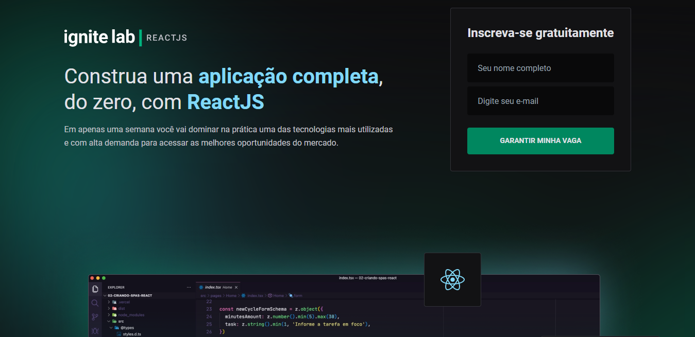

<p align="center">
  
</p>

<p align="center">
  
  
  
     
</p>

<h1 align="center">
    
</h1>

<br>

## 🧪 Tecnologias

Esse projeto foi desenvolvido com as seguintes tecnologias:

- [React](https://reactjs.org)
- [GraphCMS](https://app.graphcms.com/)
- [TypeScript](https://www.typescriptlang.org/)
- [Tailwindcss](https://tailwindcss.com/)
- [Apollo Client](https://www.apollographql.com/)
- [Vime](https://vimejs.com/)

## 🚀 Como executar

Clone o projeto e acesse a pasta do mesmo.

```bash
$ git clone https://github.com/Mateus0808/event-platform.git
$ cd event-platform
```

Para iniciá-lo, siga os passos abaixo:
```bash
# Instalar as dependências
$ yarn

# Iniciar o projeto
$ yarn dev
```
O app estará disponível no seu browser pelo endereço http://localhost:3000.

Em seguida, clique no link [model do GraphCMS](https://app.graphcms.com/clone/5b02fcd9a4b940a8b6e0b9250053ce7e?name=Ignite%20Lab%20-%20Mateus%20dos%20Santos) para clonar o model.
- Se não possuir uma conta no GraphCMS, é preciso criar.
- Acesse API Access - Endpoints - copie e cole o Endpoint Content API e o  token para seu arquivo de variáveis de ambientes
  * `VITE_API_URL: <ContentAPI>`
  * `VITE_API_ACCESS_TOKEN: <Permanent Auth Tokens>`


## 💻 Projeto
Plataforma de eventos

Acesse o site pelo link: [Event Platform](https://event-platform-rouge.vercel.app/)

---
